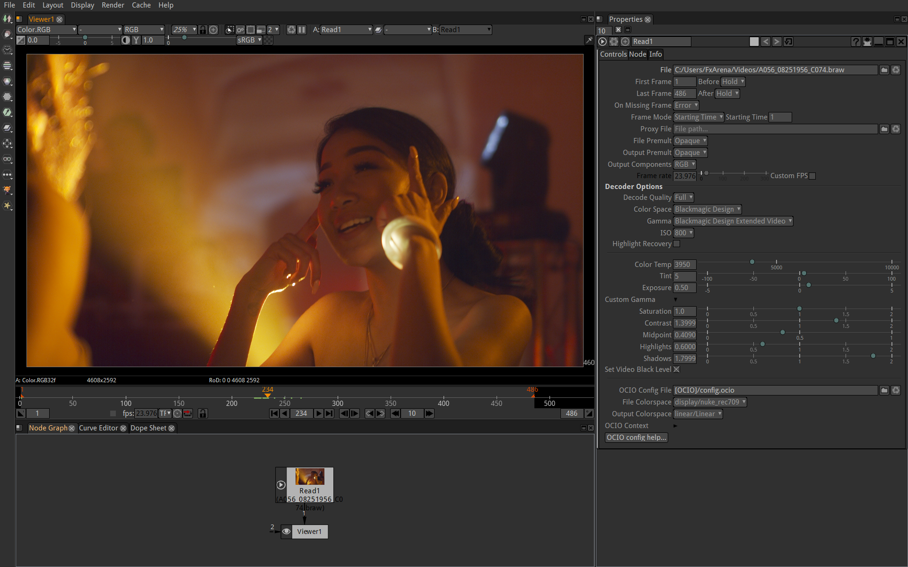

# openfx-braw

Blackmagic RAW is a modern, high performance, professional RAW codec that is open, cross platform and free. This is an OpenFX implementation designed for Natron.



## Supported cameras:

 * Blackmagic Design Pocket Cinema Camera 4K
 * Blackmagic Design URSA Mini Pro G2
 * Blackmagic Design Pocket Cinema Camera 6K
 * Blackmagic URSA Broadcast
 * Blackmagic URSA Mini Pro 12K *(experimental)*
 * Canon EOS C300 Mark II captured by Blackmagic Video Assist 12G HDR
 * Panasonic EVA1 captured by Blackmagic Video Assist 12G HDR
 * Sigma fp captured by Blackmagic Video Assist 12G HDR
 * Nikon Z 6 and Z 7 captured by Blackmagic Video Assist 12G HDR
 * Nikon Z 6II and Z 7II captured by Blackmagic Video Assist 12G HDR

## Requirements

* Natron 2.4+
* Blackmagic RAW SDK 1.8+
* Windows 10
* macOS High Sierra *(10.13)* or greater
* GNU/Linux *(Glibc 2.17+, libgcc 4.8.5+)*

## Blackmagic RAW SDK

Blackmagic RAW SDK must be installed prior to usage.

 * BRAW 2.0 SDK: [macOS](https://www.blackmagicdesign.com/no/support/download/6307842705f14a5dbb99daa90212c4ba/Mac%20OS%20X) [Linux](https://www.blackmagicdesign.com/no/support/download/6307842705f14a5dbb99daa90212c4ba/Linux) [Windows](https://www.blackmagicdesign.com/no/support/download/6307842705f14a5dbb99daa90212c4ba/Windows)
 * BRAW 1.8.2 SDK: [macOS](https://www.blackmagicdesign.com/no/support/download/50dc232a8f8b45619ecf0d9a40f92c8d/Mac%20OS%20X) [Linux](https://www.blackmagicdesign.com/no/support/download/50dc232a8f8b45619ecf0d9a40f92c8d/Linux) [Windows](https://www.blackmagicdesign.com/no/support/download/50dc232a8f8b45619ecf0d9a40f92c8d/Windows)

The Blackmagick RAW SDK will install the required library in the following locations:

* Windows: ``PROGRAMFILES\Adobe\Common\Plug-ins\7.0\MediaCore\BlackmagicRawAPI``
* Linux: ``/usr/lib64/blackmagic/BlackmagicRAWSDK/Linux/Libraries``
* macOS: ``/Applications/Blackmagic RAW/Blackmagic RAW SDK/Mac/Libraries``

The plug-in will search these locations and also ``PATH_TO_OFX_PLUGIN/Contents/Resources/BlackmagicRAW`` for the required library.

## Usage

Download [latest release](https://github.com/rodlie/openfx-braw/releases) of the plug-in and a version of the Blackmagic RAW SDK. Install the SDK then extract the openfx-braw-VERSION.zip file and copy ``BlackmagicRAW.ofx.bundle`` to the Natron OFX plug-in folder.

In Natron you will now have a new node in ``Image/Readers/BlackmagicRAW`` for reading BRAW files.

*This plug-in will need to be added to the allow list in Natron for proper reader integration, this will be done when the plug-in is declared stable on all platforms.*

## Build

Make sure OpenGL and OpenColorIO 1.1.1 libraries and include files are installed and usable from pkg-config, then:

```
git clone https://github.com/rodlie/openfx-braw
cd openfx-braw
git submodule update -i --recursive
make CONFIG=release
```
